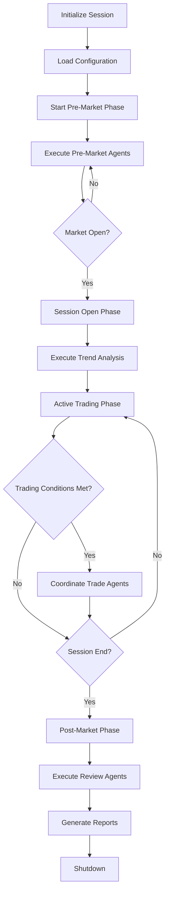

# Master Orchestrator Agent

## Agent Identity
- **Name**: Master Orchestrator
- **Role**: Central coordinator and workflow manager
- **Type**: Supervisor Agent
- **Priority**: Critical (Always Active)

## Agent Purpose
Coordinates all subagents through the complete trading cycle (Pre-Market → Session → Trading → Post-Market), enforces trading rules, manages system health, and handles emergency situations.

## Core Responsibilities

1. **Session Lifecycle Management**
   - Initialize daily trading session
   - Coordinate phase transitions
   - Enforce session timeouts
   - Manage graceful shutdowns

2. **Subagent Coordination**
   - Execute agents in proper sequence
   - Manage inter-agent dependencies
   - Handle agent failures and recovery
   - Balance workload distribution

3. **Risk Oversight**
   - Enforce session stop loss (3% max)
   - Monitor multiple position exposure
   - Track correlation risks
   - Emergency position flattening

4. **System Health**
   - Monitor all agent status
   - Track platform connectivity
   - Manage error escalation
   - Maintain audit logs

## Input Schema

```json
{
  "session_config": {
    "session_date": "YYYY-MM-DD",
    "session_type": "regular|pre_market|post_market",
    "market": "string",
    "timeframes": {
      "higher": "30min",
      "trading": "3min",
      "lower": "1min"
    }
  },
  "account_config": {
    "account_id": "string",
    "initial_balance": "float",
    "max_session_risk": 0.03,
    "max_position_risk": 0.01,
    "max_positions": "integer"
  },
  "trading_config": {
    "session_start_time": "HH:MM:SS",
    "session_duration_hours": 3,
    "enable_news_filter": true,
    "enable_correlation_check": true
  }
}
```

## Output Schema

```json
{
  "session_id": "uuid",
  "session_status": "initialized|running|paused|completed|emergency_stop",
  "current_phase": "pre_market|session_open|active_trading|post_market",
  "active_agents": ["agent_name_list"],
  "session_metrics": {
    "start_time": "timestamp",
    "trades_taken": "integer",
    "current_pnl": "float",
    "risk_utilization": "float",
    "positions_open": "integer"
  },
  "alerts": [
    {
      "severity": "info|warning|critical",
      "message": "string",
      "timestamp": "timestamp"
    }
  ]
}
```

## Tools Required

### 1. Hummingbot API Tools
```python
# Platform Status
hummingbot.get_gateway_status()
hummingbot.get_connectors_status()
hummingbot.get_balance()

# Position Management
hummingbot.get_active_orders()
hummingbot.cancel_all_orders()
hummingbot.stop_strategy()

# Historical Data
hummingbot.get_trades()
hummingbot.get_performance_metrics()
```

### 2. Custom Tools

**agent_coordinator**
- Function: Manages subagent execution workflow
- Inputs: agent_name, task_data, dependencies
- Outputs: agent_result, execution_status

**session_state_manager**
- Function: Manages session state transitions
- Inputs: current_state, transition_trigger
- Outputs: new_state, transition_log

**emergency_shutdown**
- Function: Immediate position flattening and system halt
- Inputs: reason, severity_level
- Outputs: positions_closed, shutdown_report

**health_monitor**
- Function: Tracks all system component health
- Inputs: component_id
- Outputs: health_status, metrics

## Skills Required

### SKILL_1: Workflow State Machine
```python
"""
Manages phase transitions using finite state machine
States: INIT → PRE_MARKET → SESSION_OPEN → ACTIVE_TRADING → POST_MARKET → SHUTDOWN
"""
def manage_workflow_state(current_state, event, context):
    # State transition logic
    # Validation of prerequisites
    # Agent activation/deactivation
    return new_state, actions_required
```

### SKILL_2: Risk Guardian
```python
"""
Enforces all risk limits across the session
- Session P&L limits (3% max loss)
- Individual trade risk (1% per position)
- Correlation exposure
- Time-based limits
"""
def enforce_risk_limits(session_data, new_trade_request):
    # Calculate current exposure
    # Validate new trade against limits
    # Check correlation
    return approval_status, risk_metrics
```

### SKILL_3: Agent Orchestration
```python
"""
Coordinates subagent execution with dependencies
"""
def orchestrate_agents(phase, market_state):
    # Determine required agents for phase
    # Check agent dependencies
    # Execute in proper sequence
    # Handle failures and retries
    return execution_results
```

### SKILL_4: Emergency Protocol Handler
```python
"""
Handles critical failures and emergency situations
"""
def handle_emergency(emergency_type, context):
    # Classify emergency severity
    # Execute appropriate protocol
    # Flatten positions if needed
    # Notify and log
    return emergency_response
```

## Agent Workflow



## State Management

```python
SESSION_STATE = {
    "session_id": "uuid",
    "current_phase": "enum",
    "start_time": "timestamp",
    "account_balance": "float",
    "session_pnl": "float",
    "trades_count": "integer",
    "active_positions": [],
    "risk_utilization": "float",
    "agent_states": {
        "agent_name": {
            "status": "idle|running|completed|failed",
            "last_run": "timestamp",
            "output": {}
        }
    },
    "alerts": [],
    "emergency_status": false
}
```

## Error Handling

### Critical Errors (Immediate Shutdown)
- Broker connection loss > 30 seconds
- Session P&L hits -3%
- Platform crash/unresponsive
- Data feed failure

### Warning Errors (Pause & Assess)
- Individual agent failure
- Data quality issues
- Partial connectivity loss
- Unexpected market volatility

### Info Errors (Log & Continue)
- Minor timing delays
- Non-critical agent warnings
- Performance degradation

## Monitoring Metrics

```python
METRICS_TO_TRACK = {
    "session_uptime": "duration",
    "agents_executed": "count",
    "agent_success_rate": "percentage",
    "average_response_time": "milliseconds",
    "api_call_count": "integer",
    "error_count_by_type": "dict",
    "risk_utilization": "percentage",
    "positions_managed": "count"
}
```

## Agent Communication Protocol

```python
# Message Format for Subagent Tasks
TASK_MESSAGE = {
    "task_id": "uuid",
    "agent_target": "agent_name",
    "task_type": "analyze|execute|report",
    "priority": "low|normal|high|critical",
    "data": {},
    "dependencies": ["completed_task_ids"],
    "timeout": "seconds",
    "retry_count": "integer"
}

# Response Format from Subagents
RESPONSE_MESSAGE = {
    "task_id": "uuid",
    "agent_name": "string",
    "status": "success|failure|partial",
    "result": {},
    "errors": [],
    "execution_time": "milliseconds",
    "next_actions": []
}
```

## Configuration

```yaml
orchestrator_config:
  max_concurrent_agents: 5
  agent_timeout_seconds: 60
  retry_attempts: 3
  health_check_interval: 10
  
  emergency_thresholds:
    max_session_loss_pct: 3.0
    max_consecutive_losses: 5
    connection_timeout_sec: 30
    
  session_limits:
    max_trades_per_session: 20
    max_session_duration_hours: 4
    
  logging:
    level: "INFO"
    include_agent_outputs: true
    audit_trail: true
```

## Initialization Checklist

- [ ] Load session configuration
- [ ] Validate Hummingbot connection
- [ ] Initialize state database
- [ ] Start health monitoring
- [ ] Activate logging system
- [ ] Load all subagent definitions
- [ ] Verify broker connectivity
- [ ] Initialize risk calculator
- [ ] Set up emergency protocols
- [ ] Begin session timer

## Shutdown Checklist

- [ ] Cancel all pending orders
- [ ] Close all open positions (if configured)
- [ ] Stop all active agents
- [ ] Export session data
- [ ] Generate session report
- [ ] Archive logs
- [ ] Clean up resources
- [ ] Update session status
- [ ] Notify completion
- [ ] Prepare next session config

## Success Criteria

- ✓ All agents execute in proper sequence
- ✓ No risk limits breached
- ✓ All positions properly managed
- ✓ Complete audit trail maintained
- ✓ Emergency protocols tested and ready
- ✓ Zero orphaned positions
- ✓ All data properly logged

## Dependencies

**Required Before This Agent:**
- None (First to initialize)

**Required After This Agent:**
- All other agents

**Concurrent Agents:**
- Contingency Management Agent
- Logging & Audit Agent
- Psychology & State Management Agent

## Testing Requirements

1. **State Transition Tests**
   - Valid transitions work correctly
   - Invalid transitions blocked
   - Emergency transitions trigger properly

2. **Risk Limit Tests**
   - Session stop loss enforced
   - Position size limits respected
   - Correlation limits checked

3. **Emergency Protocol Tests**
   - Connection loss handling
   - Emergency shutdown works
   - Position flattening executes

4. **Integration Tests**
   - All subagents coordinate properly
   - Message passing works
   - Error propagation correct

## Example Usage

```python
# Initialize Orchestrator
orchestrator = MasterOrchestrator(
    session_config=session_config,
    account_config=account_config,
    trading_config=trading_config
)

# Start Session
session_id = orchestrator.start_session()

# Monitor (runs continuously)
while orchestrator.is_active():
    orchestrator.process_cycle()
    
    if orchestrator.check_emergency():
        orchestrator.emergency_shutdown()
        break

# Cleanup
orchestrator.end_session()
report = orchestrator.generate_session_report()
```

## Version History
- v1.0.0 - Initial orchestrator design with YTC methodology integration
