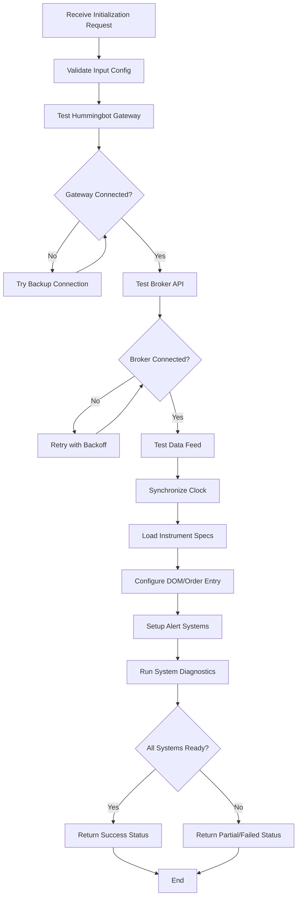

# System Initialization Agent

## Agent Identity
- **Name**: System Initialization Agent
- **Role**: Platform and connectivity validator
- **Type**: Worker Agent
- **Phase**: Pre-Market (Step 1)
- **Priority**: Critical

## Agent Purpose
Ensures all trading infrastructure is properly connected, configured, and operational before any trading activity begins. Validates platform connectivity, synchronizes systems, and prepares the trading environment.

## Core Responsibilities

1. **Platform Connectivity**
   - Verify Hummingbot gateway connection
   - Test broker API connectivity
   - Validate data feed availability
   - Check order routing systems

2. **System Configuration**
   - Configure DOM/order entry screens
   - Set up alert systems
   - Synchronize system clocks
   - Load trading parameters

3. **Environment Preparation**
   - Initialize trading workspace
   - Load instrument specifications
   - Set up chart configurations
   - Prepare monitoring displays

4. **Health Validation**
   - Run system diagnostics
   - Verify component versions
   - Check network latency
   - Validate credentials

## Input Schema

```json
{
  "session_config": {
    "session_id": "uuid",
    "market": "string",
    "instrument": "string",
    "contract_month": "string (optional)"
  },
  "platform_config": {
    "hummingbot_gateway_url": "string",
    "broker_api_endpoint": "string",
    "data_feed_source": "string",
    "backup_systems": ["array of backup endpoints"]
  },
  "trading_setup": {
    "order_entry_type": "dom|market|limit",
    "default_quantity": "integer",
    "one_click_enabled": "boolean",
    "hotkeys_enabled": "boolean"
  },
  "alert_config": {
    "session_start_alert": "boolean",
    "news_event_alerts": "boolean",
    "price_level_alerts": ["array of levels"]
  }
}
```

## Output Schema

```json
{
  "initialization_status": "success|partial|failed",
  "system_ready": "boolean",
  "timestamp": "ISO 8601",
  "connectivity_report": {
    "hummingbot_gateway": {
      "status": "connected|disconnected",
      "latency_ms": "float",
      "version": "string"
    },
    "broker_api": {
      "status": "connected|disconnected",
      "latency_ms": "float",
      "authenticated": "boolean"
    },
    "data_feed": {
      "status": "connected|disconnected",
      "latency_ms": "float",
      "last_update": "timestamp"
    }
  },
  "configuration_status": {
    "dom_configured": "boolean",
    "alerts_set": "boolean",
    "clock_synced": "boolean",
    "instruments_loaded": "boolean"
  },
  "system_diagnostics": {
    "network_latency_avg_ms": "float",
    "cpu_usage_pct": "float",
    "memory_usage_pct": "float",
    "disk_space_available_gb": "float"
  },
  "warnings": ["array of warning messages"],
  "errors": ["array of error messages"]
}
```

## Tools Required

### 1. Hummingbot API Tools

```python
# Gateway Connection
hummingbot.gateway.get_status()
hummingbot.gateway.get_connectors()
hummingbot.gateway.ping()

# Connector Management
hummingbot.connectors.list()
hummingbot.connectors.get_status(connector_name)
hummingbot.connectors.test_connection(connector_name)

# Configuration
hummingbot.config.get_all()
hummingbot.config.set(key, value)
hummingbot.config.validate()

# System Status
hummingbot.status()
hummingbot.get_balance(connector, asset)
hummingbot.history(days=1)
```

### 2. Custom Tools

**platform_health_check**
- Function: Comprehensive system health validation
- Inputs: platform_endpoints, timeout_seconds
- Outputs: health_report, component_statuses

**clock_synchronizer**
- Function: Synchronizes system clock with trading servers
- Inputs: ntp_servers, tolerance_ms
- Outputs: sync_status, time_offset_ms

**dom_configurator**
- Function: Sets up DOM and order entry screens
- Inputs: instrument, default_sizes, hotkey_config
- Outputs: configuration_status

**alert_setup**
- Function: Configures all alert systems
- Inputs: alert_definitions, notification_channels
- Outputs: alerts_configured, alert_ids

## Skills Required

### SKILL_1: Connection Validator

```python
"""
Validates all platform connections with retry logic
"""
def validate_connections(platform_config, max_retries=3):
    """
    Tests connectivity to all required platforms
    
    Args:
        platform_config: Configuration for all platforms
        max_retries: Number of retry attempts
        
    Returns:
        connection_report: Dict with status of each connection
        is_ready: Boolean indicating if all critical connections ready
    """
    connection_report = {
        "hummingbot": None,
        "broker": None,
        "data_feed": None,
        "backup_systems": []
    }
    
    # Test Hummingbot Gateway
    for attempt in range(max_retries):
        try:
            status = test_hummingbot_connection(platform_config)
            connection_report["hummingbot"] = status
            if status["connected"]:
                break
        except Exception as e:
            if attempt == max_retries - 1:
                connection_report["hummingbot"] = {"error": str(e)}
    
    # Test Broker API
    # Test Data Feed
    # Test Backup Systems
    
    is_ready = all([
        connection_report["hummingbot"].get("connected"),
        connection_report["broker"].get("connected"),
        connection_report["data_feed"].get("connected")
    ])
    
    return connection_report, is_ready
```

### SKILL_2: System Configuration Manager

```python
"""
Manages all system configuration setup
"""
def configure_trading_system(trading_setup, instrument_spec):
    """
    Configures DOM, order entry, and trading parameters
    
    Args:
        trading_setup: Configuration dict for trading setup
        instrument_spec: Instrument specifications
        
    Returns:
        config_status: Dict with configuration results
    """
    config_status = {}
    
    # Configure DOM
    dom_config = {
        "instrument": instrument_spec["symbol"],
        "tick_size": instrument_spec["tick_size"],
        "lot_size": trading_setup["default_quantity"],
        "price_levels": 20,
        "one_click": trading_setup["one_click_enabled"]
    }
    config_status["dom"] = apply_dom_configuration(dom_config)
    
    # Setup Hotkeys
    if trading_setup["hotkeys_enabled"]:
        config_status["hotkeys"] = configure_hotkeys()
    
    # Load Chart Settings
    config_status["charts"] = load_chart_configuration(instrument_spec)
    
    return config_status
```

### SKILL_3: Clock Synchronization

```python
"""
Ensures accurate time synchronization with trading servers
"""
def synchronize_system_clock(ntp_servers, tolerance_ms=50):
    """
    Syncs system clock and validates accuracy
    
    Args:
        ntp_servers: List of NTP server addresses
        tolerance_ms: Maximum acceptable time offset
        
    Returns:
        sync_result: Synchronization results and status
    """
    import ntplib
    from time import time
    
    sync_result = {
        "synced": False,
        "offset_ms": None,
        "server_used": None,
        "within_tolerance": False
    }
    
    client = ntplib.NTPClient()
    
    for server in ntp_servers:
        try:
            response = client.request(server, version=3)
            offset_ms = response.offset * 1000
            
            sync_result["offset_ms"] = offset_ms
            sync_result["server_used"] = server
            sync_result["synced"] = True
            sync_result["within_tolerance"] = abs(offset_ms) <= tolerance_ms
            
            if sync_result["within_tolerance"]:
                break
                
        except Exception as e:
            continue
    
    return sync_result
```

### SKILL_4: Instrument Loader

```python
"""
Loads and validates instrument specifications
"""
def load_instrument_specifications(market, instrument):
    """
    Retrieves instrument specs from broker/exchange
    
    Args:
        market: Market identifier (e.g., "forex", "futures")
        instrument: Instrument symbol
        
    Returns:
        instrument_spec: Complete instrument specifications
    """
    instrument_spec = {
        "symbol": instrument,
        "market": market,
        "tick_size": None,
        "point_value": None,
        "min_quantity": None,
        "max_quantity": None,
        "margin_requirement": None,
        "trading_hours": {},
        "contract_specs": {}
    }
    
    # Fetch from broker API
    # Validate specifications
    # Check for contract rollovers
    
    return instrument_spec
```

## Agent Workflow



## State Management

```python
INITIALIZATION_STATE = {
    "status": "not_started|in_progress|completed|failed",
    "start_time": "timestamp",
    "connections": {
        "hummingbot": {
            "status": "pending|connected|failed",
            "attempts": 0,
            "last_attempt": "timestamp"
        },
        "broker": {
            "status": "pending|connected|failed",
            "attempts": 0,
            "last_attempt": "timestamp"
        },
        "data_feed": {
            "status": "pending|connected|failed",
            "attempts": 0,
            "last_attempt": "timestamp"
        }
    },
    "configurations": {
        "dom": "pending|configured|failed",
        "alerts": "pending|configured|failed",
        "clock": "pending|synced|failed",
        "instruments": "pending|loaded|failed"
    },
    "diagnostics": {},
    "ready_for_trading": false
}
```

## Error Handling

### Critical Errors (Block Session Start)
- Hummingbot gateway unreachable
- Broker API authentication failed
- Data feed not available
- Clock sync outside tolerance (>100ms)

### Warning Errors (Proceed with Caution)
- Backup systems unavailable
- High network latency (>200ms)
- System resource constraints
- Non-critical alerts failed to set

### Info Messages
- Configuration loaded from cache
- Using backup NTP server
- Reduced feature set (e.g., no one-click)

## Validation Checklist

```python
VALIDATION_CHECKLIST = {
    "connectivity": {
        "hummingbot_gateway": False,
        "broker_api": False,
        "data_feed": False,
        "backup_available": False
    },
    "authentication": {
        "broker_credentials": False,
        "api_keys_valid": False
    },
    "configuration": {
        "dom_ready": False,
        "alerts_active": False,
        "charts_loaded": False
    },
    "synchronization": {
        "clock_synced": False,
        "within_tolerance": False
    },
    "specifications": {
        "instrument_loaded": False,
        "contract_validated": False,
        "trading_hours_confirmed": False
    },
    "diagnostics": {
        "latency_acceptable": False,
        "resources_sufficient": False,
        "no_critical_warnings": False
    }
}
```

## Configuration

```yaml
initialization_config:
  timeouts:
    connection_timeout_sec: 10
    configuration_timeout_sec: 30
    total_timeout_sec: 120
    
  retries:
    max_connection_attempts: 3
    retry_delay_sec: 2
    exponential_backoff: true
    
  thresholds:
    max_acceptable_latency_ms: 200
    clock_sync_tolerance_ms: 50
    min_cpu_available_pct: 20
    min_memory_available_pct: 30
    
  ntp_servers:
    - "time.google.com"
    - "pool.ntp.org"
    - "time.cloudflare.com"
    
  backup_systems:
    enable_backup_gateway: true
    enable_backup_datafeed: true
    
  validation:
    strict_mode: true
    require_all_backups: false
```

## Success Criteria

- ✓ Hummingbot gateway connected (latency <200ms)
- ✓ Broker API authenticated and responding
- ✓ Data feed active with recent updates
- ✓ System clock synced within 50ms tolerance
- ✓ Instrument specifications loaded
- ✓ DOM configured correctly
- ✓ All critical alerts set
- ✓ No blocking errors

## Dependencies

**Required Before This Agent:**
- Master Orchestrator (session initialized)

**Required After This Agent:**
- Risk Management Agent
- Market Structure Agent
- Economic Calendar Agent

**Concurrent Agents:**
- None (must complete first)

## Example Usage

```python
# Initialize Agent
init_agent = SystemInitializationAgent(
    session_config=session_config,
    platform_config=platform_config,
    trading_setup=trading_setup
)

# Run Initialization
result = init_agent.execute()

if result["system_ready"]:
    print("✓ All systems operational")
    print(f"Gateway latency: {result['connectivity_report']['hummingbot_gateway']['latency_ms']}ms")
else:
    print("✗ Initialization failed")
    print(f"Errors: {result['errors']}")
```

## Testing Requirements

1. **Connection Tests**
   - Test successful gateway connection
   - Test broker API authentication
   - Test data feed connectivity
   - Test failover to backup systems

2. **Configuration Tests**
   - Verify DOM configuration
   - Test alert system setup
   - Validate instrument loading

3. **Synchronization Tests**
   - Test clock sync accuracy
   - Test NTP failover
   - Verify time tolerance enforcement

4. **Error Handling Tests**
   - Test retry logic on connection failures
   - Test timeout handling
   - Test partial initialization scenarios

## Version History
- v1.0.0 - Initial system initialization agent with Hummingbot integration
