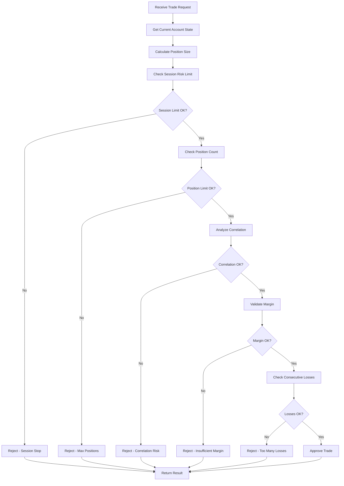

# Risk Management Agent

## Agent Identity
- **Name**: Risk Management Agent
- **Role**: Risk calculator and enforcer
- **Type**: Worker Agent  
- **Phase**: Pre-Market (Step 2) + Continuous Monitoring
- **Priority**: Critical

## Agent Purpose
Calculates and enforces all risk parameters for the trading session. Manages position sizing, tracks exposure limits, monitors correlation risks, and ensures compliance with YTC risk management principles (1% per trade, 3% session max).

## Core Responsibilities

1. **Position Size Calculation**
   - Calculate risk per trade (1% of account)
   - Determine contract/lot quantities
   - Account for different stop loss distances
   - Adjust for instrument specifications

2. **Session Risk Monitoring**
   - Track cumulative session P&L
   - Enforce 3% session stop loss
   - Monitor risk utilization
   - Track consecutive losses

3. **Multiple Position Management**
   - Calculate total exposure (max 3%)
   - Monitor correlation between positions
   - Enforce maximum position limits
   - Track breakeven positions

4. **Risk Validation**
   - Approve/reject new trade requests
   - Validate stop loss placements
   - Verify position sizing accuracy
   - Check margin requirements

## Input Schema

```json
{
  "account_data": {
    "account_id": "string",
    "balance": "float",
    "currency": "string",
    "leverage": "float"
  },
  "risk_parameters": {
    "risk_per_trade_pct": 1.0,
    "max_session_risk_pct": 3.0,
    "max_positions": 3,
    "max_total_exposure_pct": 3.0,
    "consecutive_loss_limit": 5
  },
  "instrument_specs": {
    "symbol": "string",
    "tick_size": "float",
    "tick_value": "float",
    "contract_size": "integer",
    "margin_requirement": "float"
  },
  "trade_request": {
    "setup_type": "string",
    "entry_price": "float",
    "stop_loss": "float",
    "direction": "long|short"
  }
}
```

## Output Schema

```json
{
  "risk_analysis": {
    "timestamp": "ISO 8601",
    "account_balance": "float",
    "session_pnl": "float",
    "session_pnl_pct": "float",
    "risk_capacity_remaining_pct": "float"
  },
  "position_sizing": {
    "risk_amount_currency": "float",
    "stop_distance_ticks": "integer",
    "stop_distance_currency": "float",
    "position_size_contracts": "integer",
    "position_value": "float",
    "margin_required": "float"
  },
  "exposure_analysis": {
    "current_positions": "integer",
    "total_exposure_pct": "float",
    "correlated_exposure_pct": "float",
    "positions_at_breakeven": "integer",
    "effective_risk_pct": "float"
  },
  "trade_approval": {
    "approved": "boolean",
    "risk_score": "float",
    "reasons": ["array of approval/rejection reasons"]
  },
  "limits_status": {
    "session_limit_reached": "boolean",
    "position_limit_reached": "boolean",
    "correlation_limit_exceeded": "boolean",
    "consecutive_losses": "integer"
  },
  "alerts": [
    {
      "type": "warning|critical",
      "message": "string",
      "threshold": "float"
    }
  ]
}
```

## Tools Required

### 1. Hummingbot API Tools

```python
# Account Information
hummingbot.get_balance(connector, asset)
hummingbot.get_balances()

# Position Information
hummingbot.get_open_orders()
hummingbot.get_positions()

# Performance Metrics
hummingbot.get_performance_metrics()
hummingbot.get_trades(days=1)

# Market Data
hummingbot.get_mid_price(connector, trading_pair)
hummingbot.get_order_book(connector, trading_pair)
```

### 2. Custom Tools

**risk_calculator**
- Function: Calculates position size based on risk parameters
- Inputs: account_balance, risk_pct, stop_distance, instrument_specs
- Outputs: position_size, margin_required

**correlation_analyzer**
- Function: Analyzes correlation between positions
- Inputs: positions_list, timeframe, lookback_period
- Outputs: correlation_matrix, correlated_pairs

**exposure_monitor**
- Function: Tracks total portfolio exposure
- Inputs: open_positions, account_balance
- Outputs: total_exposure_pct, risk_breakdown

**margin_validator**
- Function: Validates margin requirements
- Inputs: position_size, instrument, leverage
- Outputs: margin_required, margin_available, is_sufficient

## Skills Required

### SKILL_1: Position Size Calculator (YTC Method)

```python
"""
Calculates exact position size per YTC risk management rules
"""
def calculate_position_size(account_balance, risk_pct, entry, stop, instrument_spec):
    """
    YTC Position Sizing:
    Position Size = (Account Balance × Risk %) / (Entry - Stop) / Tick Value
    
    Args:
        account_balance: Current account equity
        risk_pct: Risk percentage (default 1.0 for 1%)
        entry: Entry price
        stop: Stop loss price
        instrument_spec: Instrument specifications
        
    Returns:
        position_data: Complete position sizing information
    """
    # Calculate risk amount in currency
    risk_amount = account_balance * (risk_pct / 100)
    
    # Calculate stop distance in price
    stop_distance = abs(entry - stop)
    
    # Calculate stop distance in ticks
    tick_size = instrument_spec["tick_size"]
    stop_distance_ticks = int(stop_distance / tick_size)
    
    # Calculate dollar risk per tick
    tick_value = instrument_spec["tick_value"]
    
    # Calculate position size
    # Position Size = Risk Amount / (Stop Distance in Ticks × Tick Value)
    if stop_distance_ticks > 0 and tick_value > 0:
        position_size_contracts = int(risk_amount / (stop_distance_ticks * tick_value))
    else:
        position_size_contracts = 0
    
    # Calculate actual risk with rounded position size
    actual_risk = position_size_contracts * stop_distance_ticks * tick_value
    
    # Calculate margin requirement
    contract_value = entry * instrument_spec["contract_size"] * position_size_contracts
    margin_required = contract_value * instrument_spec["margin_requirement"]
    
    position_data = {
        "position_size_contracts": position_size_contracts,
        "risk_amount_target": risk_amount,
        "risk_amount_actual": actual_risk,
        "risk_pct_actual": (actual_risk / account_balance) * 100,
        "stop_distance_ticks": stop_distance_ticks,
        "stop_distance_price": stop_distance,
        "tick_value": tick_value,
        "position_value": contract_value,
        "margin_required": margin_required
    }
    
    return position_data
```

### SKILL_2: Session Risk Monitor

```python
"""
Monitors session-level risk and enforces limits
"""
def monitor_session_risk(account_balance, session_pnl, open_positions, risk_limits):
    """
    Tracks session P&L against limits and determines if trading can continue
    
    Args:
        account_balance: Starting balance for session
        session_pnl: Current profit/loss for session
        open_positions: List of open positions
        risk_limits: Risk limit configuration
        
    Returns:
        risk_status: Current risk status and permissions
    """
    # Calculate session P&L percentage
    session_pnl_pct = (session_pnl / account_balance) * 100
    
    # Calculate risk capacity remaining
    max_loss_pct = risk_limits["max_session_risk_pct"]
    risk_capacity_pct = max_loss_pct - abs(min(session_pnl_pct, 0))
    
    # Check if session stop loss hit
    session_stopped = session_pnl_pct <= -max_loss_pct
    
    # Calculate current exposure from open positions
    total_risk = sum([pos["risk_amount"] for pos in open_positions])
    total_risk_pct = (total_risk / account_balance) * 100
    
    # Determine trading permissions
    can_take_new_trades = not session_stopped and risk_capacity_pct > 0.5
    can_add_to_positions = not session_stopped and total_risk_pct < risk_limits["max_total_exposure_pct"]
    
    risk_status = {
        "session_pnl": session_pnl,
        "session_pnl_pct": session_pnl_pct,
        "risk_capacity_remaining_pct": risk_capacity_pct,
        "session_stopped": session_stopped,
        "current_exposure_pct": total_risk_pct,
        "can_take_new_trades": can_take_new_trades,
        "can_add_to_positions": can_add_to_positions,
        "alert_level": get_alert_level(session_pnl_pct, max_loss_pct)
    }
    
    return risk_status

def get_alert_level(pnl_pct, max_loss_pct):
    """Determines alert level based on drawdown"""
    if pnl_pct <= -max_loss_pct:
        return "CRITICAL - Session Stopped"
    elif pnl_pct <= -(max_loss_pct * 0.8):
        return "HIGH - Approaching Limit"
    elif pnl_pct <= -(max_loss_pct * 0.5):
        return "MEDIUM - Half Limit Used"
    else:
        return "NORMAL"
```

### SKILL_3: Correlation Risk Analyzer

```python
"""
Analyzes correlation between positions to prevent overexposure
"""
def analyze_correlation_risk(positions, correlation_matrix, correlation_threshold=0.7):
    """
    Identifies highly correlated positions that increase effective risk
    
    Per YTC: Avoid highly correlated markets
    Example: Long ETH/USD + Long BTC/USD = effectively 2% risk on crypto market weakness
    
    Args:
        positions: List of open positions
        correlation_matrix: Correlation data between instruments
        correlation_threshold: Threshold for high correlation (default 0.7)
        
    Returns:
        correlation_analysis: Detailed correlation risk breakdown
    """
    correlated_groups = []
    total_correlated_risk = 0
    
    # Check each pair of positions
    for i, pos1 in enumerate(positions):
        for pos2 in positions[i+1:]:
            # Get correlation coefficient
            corr = get_correlation(
                pos1["instrument"], 
                pos2["instrument"], 
                correlation_matrix
            )
            
            # Check if same direction and highly correlated
            if abs(corr) >= correlation_threshold:
                if (pos1["direction"] == pos2["direction"] and corr > 0) or \
                   (pos1["direction"] != pos2["direction"] and corr < 0):
                    
                    # These positions are correlated
                    group = {
                        "instruments": [pos1["instrument"], pos2["instrument"]],
                        "correlation": corr,
                        "combined_risk": pos1["risk_amount"] + pos2["risk_amount"],
                        "effective_risk_multiplier": 1.0 + abs(corr)
                    }
                    correlated_groups.append(group)
                    total_correlated_risk += group["combined_risk"]
    
    correlation_analysis = {
        "has_correlated_positions": len(correlated_groups) > 0,
        "correlated_groups": correlated_groups,
        "total_correlated_risk": total_correlated_risk,
        "effective_risk_pct": calculate_effective_risk(positions, correlated_groups),
        "recommendation": generate_correlation_recommendation(correlated_groups)
    }
    
    return correlation_analysis

def get_correlation(instrument1, instrument2, correlation_matrix):
    """Retrieves correlation coefficient between two instruments"""
    # Implementation to lookup correlation
    return correlation_matrix.get((instrument1, instrument2), 0.0)
```

### SKILL_4: Trade Request Validator

```python
"""
Validates trade requests against all risk criteria
"""
def validate_trade_request(trade_request, account_state, risk_limits):
    """
    Comprehensive validation of trade request
    
    Args:
        trade_request: Proposed trade details
        account_state: Current account and position state
        risk_limits: Risk limit configuration
        
    Returns:
        validation_result: Approval status with detailed reasons
    """
    validation_checks = {
        "position_size_valid": False,
        "stop_placement_valid": False,
        "session_limit_ok": False,
        "position_limit_ok": False,
        "correlation_ok": False,
        "margin_sufficient": False,
        "consecutive_losses_ok": False
    }
    
    reasons = []
    
    # Check 1: Position size within limits
    position_data = calculate_position_size(
        account_state["balance"],
        risk_limits["risk_per_trade_pct"],
        trade_request["entry_price"],
        trade_request["stop_loss"],
        account_state["instrument_spec"]
    )
    
    if position_data["risk_pct_actual"] <= risk_limits["risk_per_trade_pct"] * 1.1:  # 10% tolerance
        validation_checks["position_size_valid"] = True
    else:
        reasons.append(f"Position size risk {position_data['risk_pct_actual']:.2f}% exceeds limit")
    
    # Check 2: Session risk limit
    if not account_state["session_stopped"]:
        validation_checks["session_limit_ok"] = True
    else:
        reasons.append("Session stop loss limit reached")
    
    # Check 3: Position count limit
    if account_state["open_positions_count"] < risk_limits["max_positions"]:
        validation_checks["position_limit_ok"] = True
    else:
        reasons.append(f"Maximum positions ({risk_limits['max_positions']}) reached")
    
    # Check 4: Correlation
    if account_state["correlated_exposure_pct"] < risk_limits["max_total_exposure_pct"]:
        validation_checks["correlation_ok"] = True
    else:
        reasons.append("Correlated exposure exceeds limits")
    
    # Check 5: Margin
    if account_state["available_margin"] >= position_data["margin_required"]:
        validation_checks["margin_sufficient"] = True
    else:
        reasons.append("Insufficient margin available")
    
    # Check 6: Consecutive losses
    if account_state["consecutive_losses"] < risk_limits["consecutive_loss_limit"]:
        validation_checks["consecutive_losses_ok"] = True
    else:
        reasons.append(f"Consecutive loss limit ({risk_limits['consecutive_loss_limit']}) reached")
    
    # Overall approval
    approved = all(validation_checks.values())
    
    if approved:
        reasons.append("All risk checks passed - Trade approved")
    
    validation_result = {
        "approved": approved,
        "checks": validation_checks,
        "reasons": reasons,
        "position_data": position_data,
        "risk_score": calculate_risk_score(validation_checks)
    }
    
    return validation_result

def calculate_risk_score(checks):
    """Calculates overall risk score 0-100"""
    passed = sum([1 for v in checks.values() if v])
    total = len(checks)
    return (passed / total) * 100
```

## Agent Workflow



## State Management

```python
RISK_STATE = {
    "session_start_balance": "float",
    "current_balance": "float",
    "session_pnl": "float",
    "session_pnl_pct": "float",
    "trades_taken": "integer",
    "winning_trades": "integer",
    "losing_trades": "integer",
    "consecutive_wins": "integer",
    "consecutive_losses": "integer",
    "open_positions": [
        {
            "position_id": "string",
            "instrument": "string",
            "direction": "long|short",
            "size": "integer",
            "entry": "float",
            "stop": "float",
            "risk_amount": "float",
            "at_breakeven": "boolean"
        }
    ],
    "risk_utilization": {
        "session_risk_used_pct": "float",
        "position_risk_used_pct": "float",
        "total_exposure_pct": "float",
        "correlated_exposure_pct": "float"
    },
    "limits_breached": {
        "session_stop_hit": "boolean",
        "position_limit_hit": "boolean",
        "consecutive_loss_limit_hit": "boolean"
    }
}
```

## Configuration

```yaml
risk_management_config:
  risk_per_trade_pct: 1.0
  max_session_risk_pct: 3.0
  max_positions: 3
  max_total_exposure_pct: 3.0
  consecutive_loss_limit: 5
  
  position_sizing:
    allow_partial_contracts: false
    min_position_size: 1
    max_position_size: 100
    
  correlation:
    enable_correlation_check: true
    correlation_threshold: 0.7
    lookback_period_days: 20
    
  margin:
    margin_safety_buffer_pct: 10.0
    check_margin_before_trade: true
    
  alerts:
    alert_at_50pct_session_risk: true
    alert_at_80pct_session_risk: true
    alert_on_consecutive_losses: 3
    alert_on_correlation_detected: true
```

## Success Criteria

- ✓ All position sizes exactly 1% risk
- ✓ Session stop enforced at -3%
- ✓ No more than 3 simultaneous positions
- ✓ Total exposure never exceeds 3%
- ✓ Correlated positions identified and limited
- ✓ All margin requirements validated
- ✓ Zero unauthorized trades

## Dependencies

**Required Before This Agent:**
- System Initialization Agent (platform ready)

**Required After This Agent:**
- Any trading execution agent

**Concurrent Agents:**
- Real-Time Monitoring Agent (continuous risk tracking)

## Testing Requirements

1. **Position Sizing Tests**
   - Verify 1% risk calculation accuracy
   - Test various stop distances
   - Validate contract rounding

2. **Session Limit Tests**
   - Enforce -3% stop loss
   - Block trades when limit hit
   - Test recovery scenarios

3. **Correlation Tests**
   - Identify correlated pairs
   - Calculate combined risk
   - Enforce exposure limits

4. **Edge Cases**
   - Zero account balance
   - Extremely tight stops
   - Maximum position size
   - All limits hit simultaneously

## Example Usage

```python
# Initialize Risk Agent
risk_agent = RiskManagementAgent(
    account_balance=100000,
    risk_limits=risk_limits
)

# Calculate position size
trade_request = {
    "entry_price": 1.2500,
    "stop_loss": 1.2475,
    "direction": "long"
}

result = risk_agent.validate_trade(trade_request)

if result["approved"]:
    position_size = result["position_data"]["position_size_contracts"]
    print(f"✓ Trade approved: {position_size} contracts")
else:
    print(f"✗ Trade rejected: {result['reasons']}")
```

## Version History
- v1.0.0 - Initial risk management agent with YTC methodology
